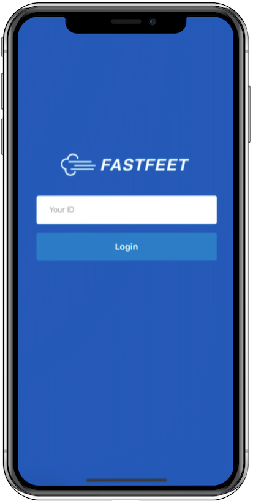
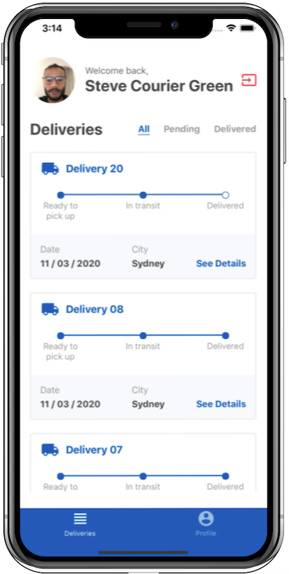
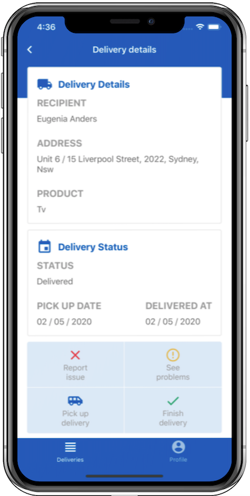

<h1 align="center">
  
</h1>

<p align="center">
  

  <a href="https://github.com/diazevedo">
    
  </a>

  
</p>

<h2 align="center">
  
  
  
</h2>

### Description

This is the mobile version of a project developed as the final challenge from [Rockeseat Bootcamp](https://rocketseat.com.br/gostack). The mobile version allows delivery men to manage their parcels, they can pick up, delivered a parcel and take a photo of that, and, report a problem. This application was tested only to IOS. Android version is coming soon, few adjustments for that have to be made.

### Technologies / Libraries


- [React Native](http://facebook.github.io/react-native/)
- [Redux](https://redux.js.org/)
  - [Redux Saga](https://redux-saga.js.org/)
- [React Navigation](https://reactnavigation.org/)
- [React Native Gesture Handler](https://kmagiera.github.io/react-native-gesture-handler/)
- [Axios](https://github.com/axios/axios)
- [Prop Types](https://github.com/facebook/prop-types)
- [Reactotron](https://github.com/infinitered/reactotron)
  - [reactotron-react-native](https://github.com/infinitered/reactotron/blob/master/docs/quick-start-react-native.md) 
  - [reactotron-redux](https://github.com/infinitered/reactotron/blob/master/docs/plugin-redux.md) 
  - [reactotron-redux-saga](https://github.com/infinitered/reactotron/blob/master/docs/plugin-redux-saga.md)
- This project was bootstrapped using [Rockeseat React Native Template](https://github.com/Rocketseat/react-native-template-rocketseat-advanced)

Requirements

- [Node](https://nodejs.org/en/).
- [Yarn](https://yarnpkg.com/) or [NPM](https://www.npmjs.com/) — I am using yarn commands over this step-by-step.
- This project consumes the [API](https://www.github/diazevedo.com/fast-feet) have it running.
  - You can create an user using the [Frontend](https://www.github/diazevedo.com/fast-feet-web) of this application.

```bash
# clonning the project
$ git clone https://github.com/diazevedo/fast-feet-mobile.git

# Go to the repository folder
$ cd fast-feet-mobile

# Installing dependencies
$ yarn or npm

# Starting the project
$ yarn start 

# To run on IOS
yarn ios

With the user ID created in the web version you will be able to access the application.
```

:bulb: Feel free to comment or to contribute with this project any thoughts on how to improve are welcome.
